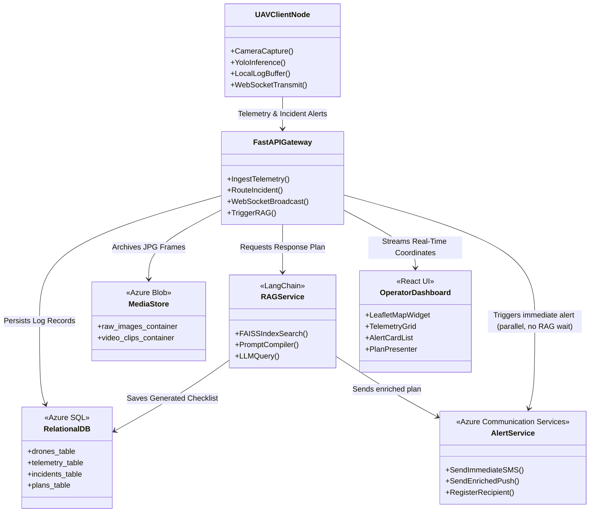

# Component Diagram

This document contains a Mermaid component diagram detailing the structural modules of the edge-cloud drone framework.

---

```mermaid
classDiagram
    class UAVClientNode {
        +CameraCapture()
        +YoloInference()
        +LocalLogBuffer()
        +WebSocketTransmit()
    }
    
    class FastAPIGateway {
        +IngestTelemetry()
        +RouteIncident()
        +WebSocketBroadcast()
        +TriggerRAG()
    }

    class RelationalDB {
        <<Azure SQL>>
        +drones_table
        +telemetry_table
        +incidents_table
        +plans_table
    }

    class MediaStore {
        <<Azure Blob>>
        +raw_images_container
        +video_clips_container
    }

    class RAGService {
        <<LangChain>>
        +FAISSIndexSearch()
        +PromptCompiler()
        +LLMQuery()
    }

    class OperatorDashboard {
        <<React UI>>
        +LeafletMapWidget
        +TelemetryGrid
        +AlertCardList
        +PlanPresenter
    }

    class AlertService {
        <<Azure Communication Services>>
        +SendImmediateSMS()
        +SendEnrichedPush()
        +RegisterRecipient()
    }

    UAVClientNode --> FastAPIGateway : Telemetry & Incident Alerts
    FastAPIGateway --> RelationalDB : Persists Log Records
    FastAPIGateway --> MediaStore : Archives JPG Frames
    FastAPIGateway --> RAGService : Requests Response Plan
    RAGService --> RelationalDB : Saves Generated Checklist
    FastAPIGateway --> OperatorDashboard : Streams Real-Time Coordinates
    FastAPIGateway --> AlertService : Triggers immediate alert (parallel, no RAG wait)
    RAGService --> AlertService : Sends enriched plan
```
