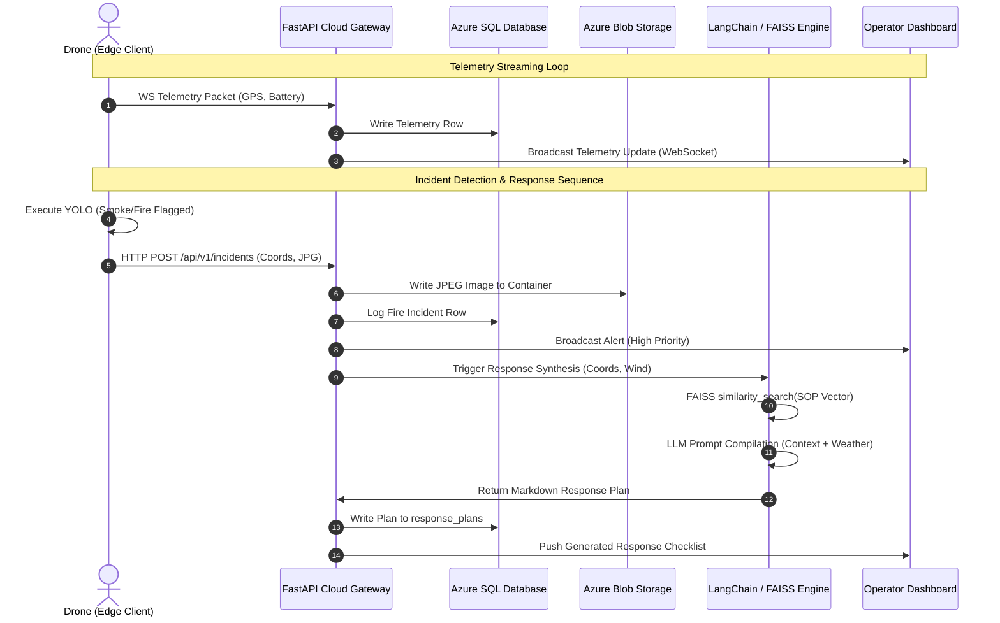

# Sequence Diagram

This document contains a Mermaid sequence diagram detailing the telemetry streaming and RAG planning execution loops.

---

```mermaid
sequenceDiagram
    autonumber
    actor UAV as Drone (Edge Client)
    participant API as FastAPI Cloud Gateway
    participant DB as Azure SQL Database
    participant Blob as Azure Blob Storage
    participant RAG as LangChain / FAISS Engine
    participant UI as Operator Dashboard

    %% Telemetry Stream Loop
    Note over UAV, UI: Telemetry Streaming Loop
    UAV->>API: WS Telemetry Packet (GPS, Battery)
    API->>DB: Write Telemetry Row
    API->>UI: Broadcast Telemetry Update (WebSocket)

    %% Incident Alert Loop
    Note over UAV, UI: Incident Detection & Response Sequence
    UAV->>UAV: Execute YOLO (Smoke/Fire Flagged)
    UAV->>API: HTTP POST /api/v1/incidents (Coords, JPG)
    API->>Blob: Write JPEG Image to Container
    API->>DB: Log Fire Incident Row
    API->>UI: Broadcast Alert (High Priority)
    API->>RAG: Trigger Response Synthesis (Coords, Wind)
    RAG->>RAG: FAISS similarity_search(SOP Vector)
    RAG->>RAG: LLM Prompt Compilation (Context + Weather)
    RAG->>API: Return Markdown Response Plan
    API->>DB: Write Plan to response_plans
    API->>UI: Push Generated Response Checklist
```
