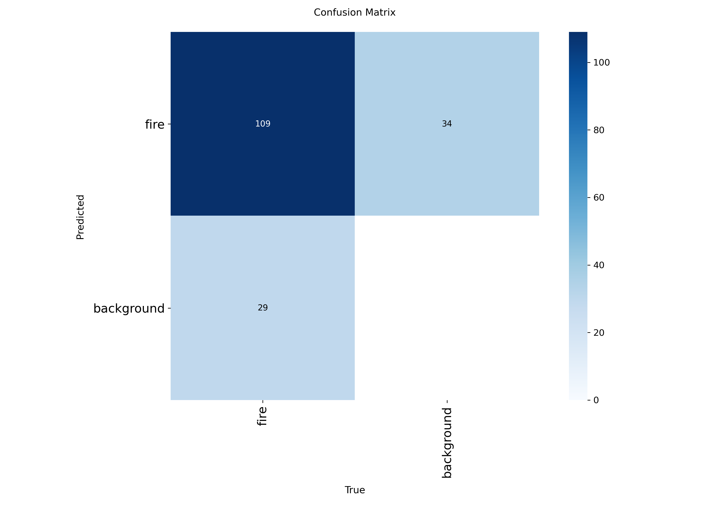
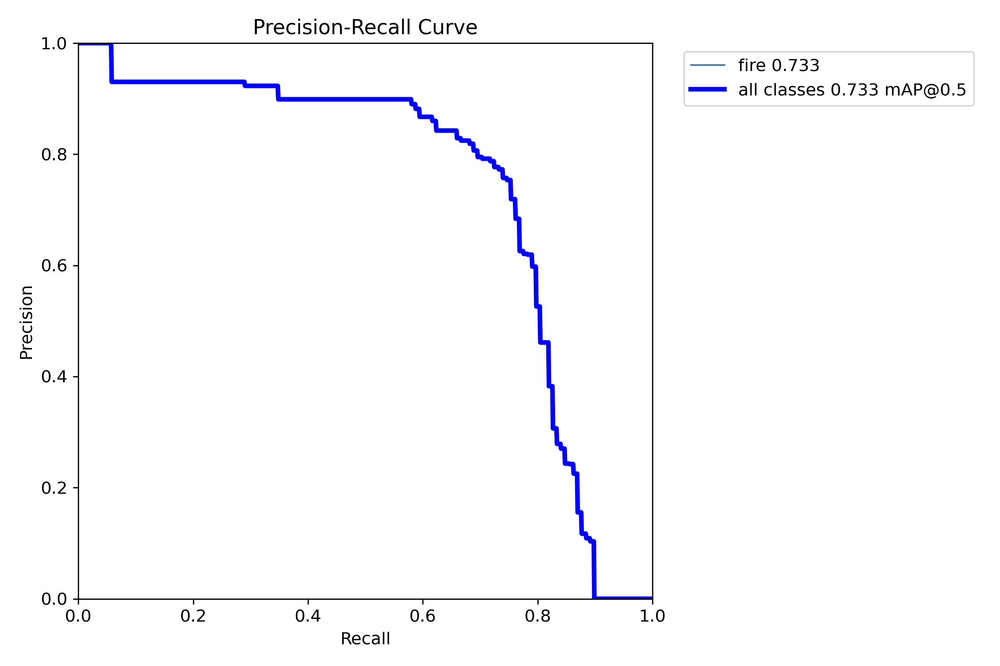
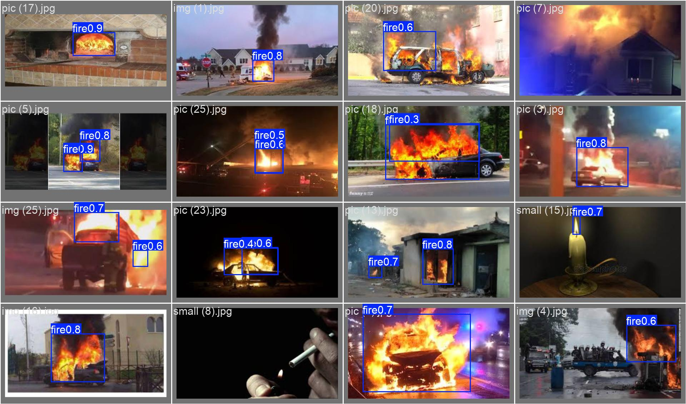

# Results & Metrics

**Rule (from the briefs): no fabricated numbers.** Every value here comes from an
actual run of actual code on real data, or it is marked `PENDING` with the reason.
Reproduce commands are given so a teammate or the examiner can re-run them.

Config used for the Phase-3 measured numbers: **local** (SQLite + filesystem Blob),
**`LLM_MODE=gemini`** (`gemini-2.5-flash`), **`YOLO_MODE=finetuned`**, CPU-only
(AMD Ryzen 7 5800H, no GPU).

---

## MEASURED

### 1. YOLO detection — FireNet, real bounding boxes

| Metric | Value | Gate | Verdict |
| :--- | ---: | :--- | :--- |
| mAP@0.5 | **0.733** | CV-1 ≥ 0.88 | **NOT MET** |
| mAP@0.5:0.95 | 0.349 | — | — |
| precision / recall | 0.766 / 0.739 | — | — |
| throughput (CPU, 512 px) | **37.3 FPS** | CV-2 ≥ 30 | met on CPU (gate is defined for Jetson+TensorRT — see note) |

- Weights: `ai/models/weights/wildfire_yolov8n.pt` — `yolov8n.pt` fine-tuned **50 epochs, imgsz 512** on the FireNet YOLO train split (412 images, single class `fire`).
- Reproduce: `python -m ai.models.train_yolo detect --epochs 50 --imgsz 512` then `python -m ai.evaluation.run_yolo_eval --task detect`.
- Held-out set: FireNet `validation/` (90 images), converted to YOLO format by `ai/models/prepare_firenet.py`.
- **Why CV-1 is missed, stated plainly:** FireNet gives only **412** training images of **one** class at low resolution; 50 CPU epochs. The 88% target assumed FLAME-scale (47,992-frame) box-annotated data, which FLAME's *classification* sub-item does not provide. FireNet is a documented *secondary* set (`docs/research/datasets.md`). Closing CV-1 needs FLAME box annotations (from its segmentation-mask sub-item) + GPU training. This is a **data-scale** shortfall, not a framework problem — the architecture (ADR-001) trained cleanly and hit the speed target.
- **CV-2 note:** 37.3 FPS is real but measured on a desktop CPU. The gate is written for a Jetson Orin with a TensorRT engine; on-hardware benchmarking is still open (see PENDING).

**Visual evidence** (regenerate with `python -m ai.evaluation.run_yolo_eval --task detect`,
output lands in `runs/detect/val-*/`; copies below are committed so they render without
re-running anything):

| Confusion matrix | Precision-recall curve |
| :---: | :---: |
|  |  |

Sample predictions on held-out FireNet validation images (blue boxes = model output, label = class + confidence):

### 2. FLAME frame classifier (approximation — NOT a detector)

| Metric | Value |
| :--- | ---: |
| top-1 acc, seeded val split (same distribution as train) | **0.995** |
| top-1 acc, held-out `Test/` folder (separate FLAME release) | **0.718** |

- Weights: `ai/models/weights/wildfire_yolov8n_cls.pt` — `yolov8n-cls.pt` fine-tuned **10 epochs, imgsz 224**, 4000 images/class subsample.
- Reproduce: `FLAME_MAX_PER_CLASS=4000 python -m ai.models.train_yolo cls --epochs 10 --imgsz 224` then `python -m ai.evaluation.run_yolo_eval --task cls`.
- FLAME's frame-level set is **classification-only** (folder = label, no boxes), so this is a whole-frame Fire/No_Fire classifier used as an approximation. **It is not compared to the CV-1 mAP gate.**
- The 0.995 → 0.718 drop from val to `Test/` is real generalization loss: `Test/` is a genuinely separate FLAME release (different flights/scenes), and matches FLAME's own documented dry-conifer / scene bias (`datasets.md`). 0.72 on a balanced 2-class set is still well above the 0.50 chance line.
- Split deviation (no flight timestamps in this sub-item → seeded random stratified split instead of chronological) is recorded in `docs/adr/ADR-001.md` → Outcome Addendum.

### 3. RAG grounding / RQ3 — real Gemini output vs expert reference plans

| Metric | Value | Gate | Verdict |
| :--- | ---: | :--- | :--- |
| mean BERTScore F1 vs 4 hand-written expert plans | **0.827** | — | — |
| hallucinated-source rate (cited SOP file not in the retrieved set) | **0.0%** | CG-2 ≤ 1.0% | **MET** |
| inline SOP-citation coverage (claim lines carrying a `(NN_*.txt)` cite) | **25 / 27** | — | — |
| `INSUFFICIENT_CONTEXT` returns | 0 / 4 | — | — |

- Reproduce: `LLM_MODE=gemini python -m ai.rag.evaluate_rag` → `results/rag-metrics/rag_eval.json`.
- Model: `gemini-2.5-flash` via `google-genai`, `thinking_budget=0`, k=4 retrieved chunks, the unchanged bounded prompt (`ai/rag/orchestrate.py`).
- Reference set: `ai/rag/reference_plans/` — 4 incidents + hand-written "ideal" plans grounded only in the 5 sample SOPs.
- **Caveat:** 4 test incidents over a 5-file SOP corpus is a *demo-scale* evaluation, not a production benchmark. `bert-score` uses `distilbert-base-uncased`.

### 4. End-to-end latency / throughput

| Measurement | p50 | p95 | n |
| :--- | ---: | ---: | ---: |
| `POST /api/v1/incidents` (detect→immediate alert→RAG plan→enriched alert, `SYNC_RAG=true`, `LLM_MODE=mock`) | 73.4 ms | 81.7 ms | 20 |
| `generate_plan()` in isolation, real sentence-transformer retrieval + `LLM_MODE=mock` | 46.2 ms | 50.2 ms | 15 |
| `generate_plan()` in isolation, real Gemini API (`gemini-2.5-flash`, network round trip included) | 3.62 s | 4.75 s | 3 |
| `WS /ws/telemetry`, 10 concurrent simulated drones × 30 ticks each | — | — | 300 msgs, **198 msg/s**, 0 errors |

- Reproduce: `EMBED_MODE=auto python testing/benchmark_latency.py` (add
  `GEMINI_API_KEY_REAL=<key>` to also sample real Gemini latency — kept to n=3 sequential
  calls on purpose, to stay inside the free-tier rate limit; this is a latency sample, not
  a load test of the LLM). Full run: [`latency/benchmark.json`](latency/benchmark.json).
- Measured in-process via `fastapi.testclient.TestClient` (CPU-only, no GPU, sqlite/local
  storage), so these numbers exclude real network/TLS overhead — real Azure Container Apps
  latency would add that on top of the ~73 ms pipeline cost shown here.
- The ~3.6 s Gemini figure is the dominant cost in the full pipeline once real generation
  replaces the mock — everything else (detection, retrieval, DB writes, alert dispatch) is
  under 100 ms combined.

### 5. End-to-end pipeline (unchanged from Phase 2, re-verified Phase 3)

| Check | How |
| :--- | :--- |
| POST incident ⇒ `alerts` row + `response_plans` row; immediate alert timestamp ≤ enriched | `pytest testing/unit/test_incidents_route.py` (9/9 suite passes) |
| Live `LLM_MODE=gemini` end-to-end (real API) | POST → immediate mock SMS → real Gemini plan (`llm_mode=gemini`, grounded, cited) → enriched mock SMS/push |
| RAG retrieval returns k ranked chunks, non-decreasing true-L2 | `pytest testing/unit/test_rag_retrieve.py` |

---

## PENDING (genuinely blocked)

| Metric | Blocked on |
| :--- | :--- |
| CV-1 mAP@0.5 ≥ 88% | FLAME box annotations (segmentation-mask sub-item → boxes) + GPU training; FireNet alone is too small |
| CV-2 on real hardware | a physical/emulated Jetson Orin + a TensorRT engine (CPU FPS 37.3 is a proxy only) |
| CL-1 bandwidth reduction ≥ 70% | a measured raw-video streaming baseline to compare the metadata channel against |
| CG-1 retrieval recall ≥ 90% | a labelled query→SOP relevance set (only the 4-incident grounding eval exists) |
| AL-1 against a real SMS provider | Azure Communication Services number; kept mocked on purpose (`cloud/DEPLOY.md` → "Left mocked") |
| Real Azure deployment reachable | `terraform apply` + container/SWA deploy from `cloud/DEPLOY.md` — IaC written, provisioning is credential-gated and not run from this repo |

Machine-written run outputs live in `yolo-metrics/` and `rag-metrics/`
(git-ignored except `last_run.json`, `train_*.json`, `rag_eval.json`, and this README).
